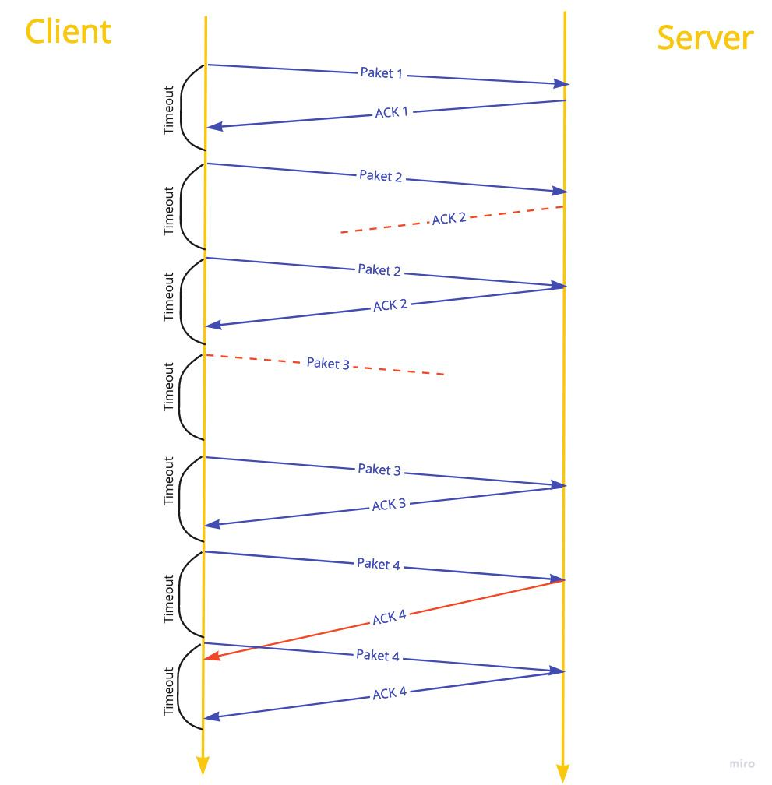

# BasicFileTransferProtocol

This is a basic file transfer program that uses stop-and-wait ARQ protocol.

### Client usage:
java  bft.Client [OPTIONS ...]  SERVER  PORT  FILE
where
OPTIONS  := { -d[ebug] | -h[elp] | -r retrans_timeout_ms }

### Server usage:
java  bft.Server [OPTIONS ...]  PORT  DIRECTORY
where
OPTIONS  := { -d[ebug] | -h[elp] }

